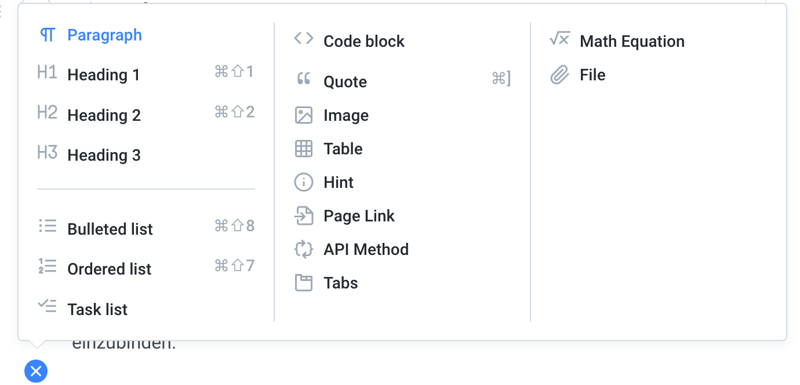

# Welche Plattformen können zur Veröffentlichung genutzt werden?

Für OER-Materialien gibt es mittlerweile sehr viele Möglichkeiten diese zu veröffentlichen. Klassischerweise sind dabei immer noch Austauschplattformen wie [4teachers.de](www.4teachers.de) oder auch die eigene Website zu nennen. Diese sind einfach in der Handhabung sind jedoch manchmal begrenzt in der Art und Weise wie Inhalte publiziert werden können. Oder sie erzielen nicht den gleichen gewünschten Reichweiteneffekt, wie Plattformen, die gleichzeitig auch Autorenwerkzeuge zur Verfügung stellen.

## [ZUM-Unterrichten](https://unterrichten.zum.de/wiki/Hauptseite) für Lernpfade

Die im deutschsprachigen Raum größte Plattform ist sicherlich das ZUM-Wiki und die neue Plattform [ZUM-Unterrichten](https://unterrichten.zum.de/wiki/Hauptseite) unter dem gleichen Vereinsdach. Hier können wirklich leicht, ganze Unterrichtsinhalte digital angelegt und mit interaktiven Aufgaben \(z.B. auch aus GeoGebra.org oder oder learningsapps.org\) angereichert werden.

* [https://unterrichten.zum.de/wiki/Hilfe:Erste\_Schritte](https://unterrichten.zum.de/wiki/Hilfe:Erste_Schritte)

**Beispiel:** [https://unterrichten.zum.de/wiki/Nullstellen\_bestimmen](https://unterrichten.zum.de/wiki/Nullstellen_bestimmen)

## [Tutory.de](https://www.tutory.de/) für Arbeitsblätter

Tutory.de ist eine relativ neue deutsche Plattform zur Erstellung und Veröffentlichung von Arbeitsblättern unter freien Lizenzen. Ein Leitfaden zur Arbeit mit Tutory.de wird ebenfalls bereitgestellt, allerdings sind einige Feature von Tutory.de kostenpflichtig:

* [https://www.tutory.de/leitfaden-oer](https://www.tutory.de/leitfaden-oer)

**Beispiel:** [https://www.tutory.de/worksheet/a5c3e300-b480-11e5-bcf3-37e4e671e33f](https://www.tutory.de/worksheet/a5c3e300-b480-11e5-bcf3-37e4e671e33f)

## [SlideWiki](https://www.slidewiki.org) für Präsentationen

Was ZUM-Unterrichten für Lernpfade ist und Tutory.de für Arbeitsblätter ist, dass ist SlideWiki für digitale Präsentationen. Hier können digitale Präsentationen unter freien Lizenzen hochgeladen, erstellt und veröffentlicht werden. EIne ausführliche Beschreibung findet sich unter folgendem Link:

* [https://blogs.tib.eu/wp/tib/2018/02/02/crowdsourcing-oer-was-ist-slidewiki-und-warum-sie-es-benutzen-sollten/](https://blogs.tib.eu/wp/tib/2018/02/02/crowdsourcing-oer-was-ist-slidewiki-und-warum-sie-es-benutzen-sollten/)

**Beispiel:** [https://slidewiki.org/deck/116595-1/deutsch-prapositionen?language=de](https://slidewiki.org/deck/116595-1/deutsch-prapositionen?language=de)

## [GeoGebra.org](https://www.geogebra.org) für Mathematik

GeoGebra.org ist für Mathematik weltweit wohl die größte Plattform zur Erstellung und Verbereitung interaktiver Aufgabenformate. Alle Inhalte können dort frei genutzt und verändert werden, da sie unter einer CC-Lizenz stehen.

Wie eigene Aktivitäten oder Mathe-Bücher erstellt werden können wird in einem GeoGebra-Buch erklärt:

* [https://www.geogebra.org/m/hDf78XkV](https://www.geogebra.org/m/hDf78XkV)

**Beispiel:** [https://www.geogebra.org/m/MdjxWe8v](https://www.geogebra.org/m/MdjxWe8v)

## [GitBook.com](https://www.gitbook.com) für Lehrbücher

Wie Tutory.de so ist auch GitBook eine kommerzielle Plattform. Auf dieser Plattform können mit relativ geringem Aufwand kleine Lehrbücher erstellt werden, so wie dieser Leitfaden zu OER. Allerdings gibt es nach einem Relaunch der Plattform derzeit noch kein Preismodell für Bildungsinstitutionen. Interessant ist an dieser Plattform allerdings, dass einzelne Nutzer eben einer Institution zugeordnet sein können, so dass mehrer Nutzer, wie zum Beispiel auch bei Google-Docs an einem Dokument/Buch gemeinsam arbeiten können. Außerdem bietet GitBook viele Feature an, interaktive Elemente einzubinden. Ebenfalls integriert ist eine Versionierung und ein Export über GitHub.com.

Die hier abgebildete Grafik zeigt alle Elemente, die in GitBook eingefügt werden können.

Wer jedoch eine eigenen Webspace zur Verfügung hat und sich technisch nicht scheut, könnte sich alternativ in elearn.js einarbeiten:

* [http://www.sumo.uni-hamburg.de/DigitaleSkripte/](http://www.sumo.uni-hamburg.de/DigitaleSkripte/)
* [https://github.com/elb-min-uhh/elearn.js](https://github.com/elb-min-uhh/elearn.js)

## [LearningApps.org](https://learningapps.org/) für interaktive Aufgaben

Interaktive Aufgabenformate können kostenlos auf learningapps.org erstellt, geteilt und verändert werden. Die dort erstellten Aktivitäten können leicht auch in klassisches Stationenlernen eingebaut werden, indem Sie ein Tablet-PC als Station zur Verfügung stellen.

Diese Aktivitäten können auch leicht in ein LMS, eine Website oder ein digtales Lehrwerk eingebunden werden. Eine einfache Einführung findet sich hier:

* [https://learningapps.org/tutorial.php](https://learningapps.org/tutorial.php)

Als Beispiel zu Learningapps.org nun ein kleines OER-Quiz zum Abschluss:

### Quiz

Zum Abschluss gibt es dann noch ein kleines Quiz, dass auf der Plattform learningsapps.org erstellt wurde:



