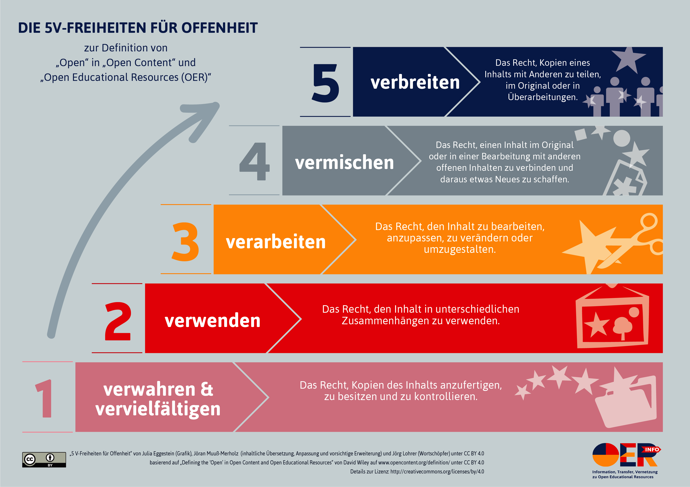

# Was sind OER?

OER steht für **O**pen **E**ducational **R**esources und kann mittlerweile als eine weltweite, lose Bewegung gesehen werden, in der verschiedenste Akteure sich dafür engagieren, dass Bildungsmaterialien unter freien Lizenzen frei ausgetauscht werden können. Dabei stehen 5 V-Freiheiten \(im Englischen 5 Rs\) im Zentrum:

1. **Verwahren/Vervielfältigen** – das Recht, Kopien des Inhalts anzufertigen, zu besitzen und zu kontrollieren \(z.B. Download, Speicherung und Vervielfältigung\)
2. **Verwenden** – das Recht, den Inhalt in unterschiedlichen Zusammenhängen einzusetzen \(z.B. im Klassenraum, in einer Lerngruppe, auf einer Website, in einem Video\)
3. **Verarbeiten** – das Recht, den Inhalt zu bearbeiten, anzupassen, zu verändern oder umzugestalten \(z.B. einen Inhalt in eine andere Sprache zu übersetzen\)
4. **Vermischen** – das Recht, einen Inhalt im Original oder in einer Bearbeitung mit anderen offenen Inhalten zu verbinden und aus ihnen etwas Neues zu schaffen \(z.B. beim Einbauen von Bildern und Musik in ein Video\)
5. **Verbreiten** – das Recht, Kopien eines Inhalts mit Anderen zu teilen, im Original oder in eigenen Überarbeitungen \(z.B. einem Freund eine Kopie zu geben oder online zu veröffentlichen\)

Der folgende Film beschreibt kurz den Nutzen den OER im Bildungskontext haben.




Text \(Übersetzung, Anpassung und vorsichtige Erweiterung\) von Jöran Muuß-Merholz für [www.open-educational-resources.de](http://www.open-educational-resources.de) – Transferstelle für OER unter [Creative Commons Attribution 4.0 license](https://creativecommons.org/licenses/by/4.0/). Das Ausgangsmaterial stammt von David Wiley. / This material is based on original writing by David Wiley, which was published freely under a [Creative Commons Attribution 4.0 license](https://creativecommons.org/licenses/by/4.0/) at [http://www.opencontent.org/definition/](http://www.opencontent.org/definition/)


